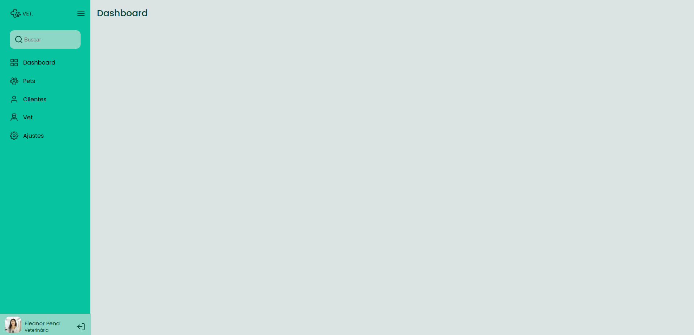

# Desafio: Sidebar

## :rocket: Sobre o desafio

Neste desafio você deve criar uma sidebar como na imagem acima. Quando o usuário clicar no ícone do menu isso deve fazer com que o estado da sidebar mude entre "aberto", mostrando ícones e texto e "fechado", mostrando apenas os ícones.

Figma: https://www.figma.com/file/KAgJ7n27CZwDHp6zwHvNB5/DD-%2F-Sidebar-Responsiva-(Copy)

